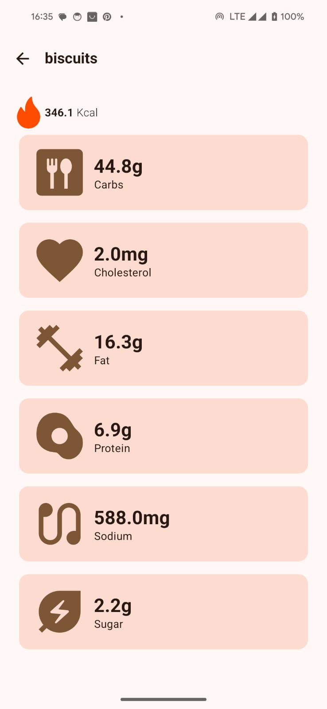

## CalorieBytez App

This is a simple Android app that uses the [Calorie Ninja](https://calorieninjas.com/api) to display 
nutritional data for various food items.


*Pre-requisites*
- Built on A.S JellyFish
- JDK 17
- Access token from CalorieNinja.
- Once received place it in the local.properties file as follows:
``` properties
API_KEY = YourKey
```
To Inject the Key when using CI/CD with github actions , add the key to your projects secrets and extract in  to your build workflow:

``` yaml
                  - name: Get local.properties from secrets
                    run: echo "${{secrets.LOCAL_PROPERTIES }}" > $GITHUB_WORKSPACE/local.properties
```


## Architecture

This project uses a modularized approach using MVVM with Clean architecture which has the following advantages

- Loose coupling between the code - The code can easily be modified without affecting any or a large part of the app's codebase thus easier to scale the application later on.
- Easier to test code.
- Separation of Concern - Different modules have specific responsibilities making it easier for modification and maintenance.

### Modularization Structure

- `core`
    - `data`
      - aggregates the data from the network and local database
    - `network`
        - handles getting data from any server/remote source
    - `database`
        - handles getting cached device data
- `domain`
    - defines the core business logic for reuse
- `app`
    - handles Ui logic of the app i.e navigation and use of the bottom bar.
- `feature`
    - `Search`
        - handles displaying data of queried item combinations
    - `Food Details`
        - handles displaying all food nutritional details
    - `Saved Food`
        - handles displaying food saved locally
- `testing`
  - Encompasses the core testing functionality of the project


| Modularization Graph                       |
|--------------------------------------------|
|  |

### Testing

The app includes unit tests for all modules, Instrumented tests are ran as unit tests with the use of Roboelectric
#### tests screenshots

| Image | desc                              |
|---|-----------------------------------|
|  | Unit tests for the ViewModels     |
|  | Unit tests for the data layer     |
|  | Unit tests for the network layer  |
|  | Unit tests for the database layer |


## TechStack
### Libraries
* Tech-stack
    * [Kotlin](https://kotlinlang.org/) - a modern, cross-platform, statically typed, general-purpose programming language with type inference.
    * [Coroutines](https://kotlinlang.org/docs/reference/coroutines-overview.html) - lightweight threads to perform asynchronous tasks.
    * [Flow](https://kotlinlang.org/docs/reference/coroutines/flow.html) - a stream of data that emits multiple values sequentially.
    * [StateFlow](https://developer.android.com/kotlin/flow/stateflow-and-sharedflow#:~:text=StateFlow%20is%20a%20state%2Dholder,property%20of%20the%20MutableStateFlow%20class.) - Flow APIs that enable flows to emit updated state and emit values to multiple consumers optimally.
    * [Dagger Hilt](https://dagger.dev/hilt/) - a dependency injection library for Android built on top of [Dagger](https://dagger.dev/) that reduces the boilerplate of doing manual injection.
    * [Jetpack](https://developer.android.com/jetpack)
        * [Jetpack Compose](https://developer.android.com/jetpack/compose) - A modern toolkit for building native Android UI
        * [Lifecycle](https://developer.android.com/topic/libraries/architecture/lifecycle) - perform actions in response to a change in the lifecycle state.
        * [ViewModel](https://developer.android.com/topic/libraries/architecture/viewmodel) - store and manage UI-related data lifecycle in a conscious manner and survive configuration change.
        * [Room](https://developer.android.com/training/data-storage/room) - An ORM that provides an abstraction layer over SQLite to allow fluent database access.
    * [Timber](https://github.com/JakeWharton/timber) - a highly extensible Android logger.
    * [Ktor](https://ktor.io/) - A pure Create asynchronous http client
    
    
* Tests
    * [JUnit](https://junit.org/junit4/) - a simple framework for writing repeatable tests.
    * [MockK](https://github.com/mockk) - mocking library for Kotlin
    * [Truth](https://github.com/agoda-com/Kakao) - A fluent assertions library for Android and Java.
* Gradle
    * [Gradle Kotlin DSL](https://docs.gradle.org/current/userguide/kotlin_dsl.html) - An alternative syntax for writing Gradle build scripts using Koltin.
    * [Version Catalogs](https://developer.android.com/build/migrate-to-catalogs) - A scalable way of maintaining dependencies and plugins in a multi-module project.
    * [Convention Plugins](https://docs.gradle.org/current/samples/sample_convention_plugins.html) - A way to encapsulate and reuse common build configuration in Gradle, see [here](https://github.com/daniel-waiguru/WeatherApp/tree/main/build-logic%2Fconvention%2Fsrc%2Fmain%2Fjava)
    * Plugins
        * [Ktlint](https://github.com/JLLeitschuh/ktlint-gradle) - creates convenient tasks in your Gradle project that run ktlint checks or do code auto format.
        * [Spotless](https://github.com/diffplug/spotless) - format Java, groovy, markdown, and license headers using gradle.
* CI/CD
    * [GitHub Actions](https://github.com/features/actions)

## ScreenShots
## Screenshots with Descriptions in Columns

| Loading | Recent Searches | Food List |
|---|---|---|
|  |  |  |

| Idle | Details | Error Screen |
|---|---|--------------|
|  |  | 


